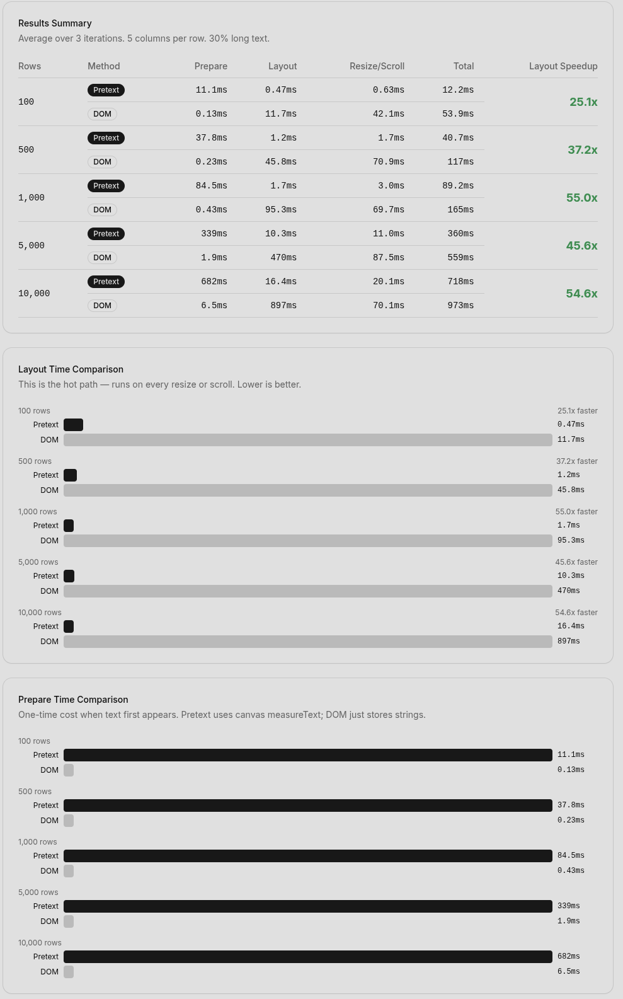

# Custom Svelte Components

A collection of custom, performance-focused components for SvelteKit and Svelte 5. Built on top of [shadcn-svelte](https://shadcn-svelte.com) with Tailwind CSS v4.

Components in `src/lib/components/ui/` are standard shadcn-svelte primitives. Components in `src/lib/components/custom/` are custom-built for use cases where off-the-shelf solutions fall short.

## Stack

- **Svelte 5** (runes mode)
- **SvelteKit** with [Remote Functions](https://svelte.dev/docs/kit/remote-functions) (experimental)
- **shadcn-svelte** (Vega preset)
- **Tailwind CSS v4**
- **TypeScript** (strict)

## Components

### Virtual Table

`src/lib/components/custom/virtual-table/`

A fully custom virtual table that renders only visible rows. No TanStack Table, no TanStack Virtual — built from scratch to integrate tightly with SvelteKit Remote Functions and [pretext](https://github.com/chenglou/pretext) for DOM-free height prediction.

**Features:**
- Virtualized scrolling with configurable overscan
- Row height prediction via pretext (canvas `measureText`, no DOM reflow)
- Server-side pagination, sorting, and filtering via Remote Functions
- Inline cell editing (text, number, select) with double-click
- Optimistic updates with rollback and retry
- Toggleable optimistic strategy: custom layer vs Remote Functions `.withOverride()`
- Column visibility toggles
- Delete with single-flight server refresh

**Modules:**

| Module | Description |
|--------|-------------|
| `virtual-table.svelte` | Main component — scroll container, header, visible row rendering |
| `virtual-scroller.svelte.ts` | Pure arithmetic: scroll position to visible row range |
| `height-manager.svelte.ts` | Wraps pretext `prepare()` / `layout()` for row heights |
| `optimistic.svelte.ts` | Optimistic update/delete overlay with commit, rollback, retry |
| `editable-cell.svelte` | Inline editing with Enter/Escape/blur |
| `types.ts` | `ColumnDef`, `SortState` |

See the [component README](src/lib/components/custom/virtual-table/README.md) for full API docs.

## Demos

| Route | Description |
|-------|-------------|
| `/demo` | Virtual table with 10k rows, full CRUD, config panel |
| `/benchmark` | Pretext vs DOM height measurement performance comparison |

### Benchmark results

Layout time comparison — pretext (canvas) vs traditional DOM (offsetHeight). The layout phase is the hot path that runs on every resize or scroll event.



| Rows | Pretext (layout) | DOM (layout) | Speedup |
|------|------------------|--------------|---------|
| 100 | 0.47ms | 11.7ms | **25x** |
| 500 | 1.2ms | 45.8ms | **37x** |
| 1,000 | 1.7ms | 95.3ms | **55x** |
| 5,000 | 10.3ms | 470ms | **46x** |
| 10,000 | 16.4ms | 897ms | **55x** |

Pretext has a higher upfront cost (prepare phase) but the layout hot path is 25-55x faster. In a virtual table, only visible rows (~50-100) are prepared at a time, so the prepare cost is negligible.

## Getting started

```bash
git clone https://github.com/jvz-devx/custom-svelte-components.git
cd custom-svelte-components
npm install
npm run dev
```

Then open [http://localhost:5173](http://localhost:5173).

## Testing

```bash
npm run check    # type check
npx vitest run   # 107 tests
```

## Project structure

```
src/
  lib/
    components/
      ui/                   # shadcn-svelte primitives (button, input, card, etc.)
      custom/               # custom components
        virtual-table/      # virtual table + optimistic state + pretext integration
    server/
      demo-db.ts            # in-memory mock database (10k users)
    utils.ts                # cn() class utility
  routes/
    demo/                   # virtual table demo page
      data.remote.ts        # remote functions (query, command, form)
      +page.svelte
    benchmark/              # pretext vs DOM benchmark
      +page.svelte
    +page.svelte            # index with links
```

## License

MIT
